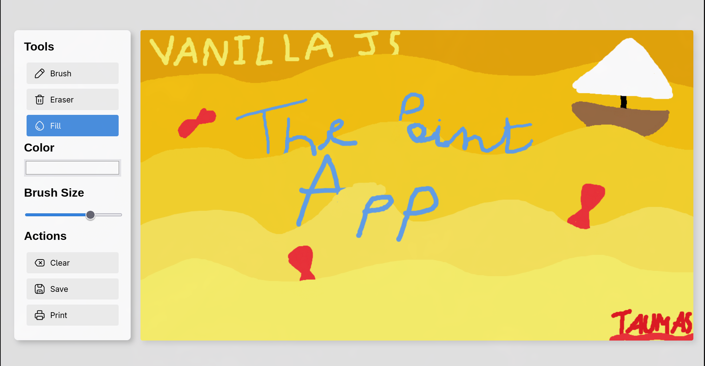

# The Paint Project

A simple paint application built with vanilla JavaScript. No frameworks, just plain JS and Canvas API 😌.

## Features

- **Drawing tools** - Brush with adjustable size and color
  

- **Fill tool** - Flood fill algorithm (the trickiest part to get right!)
  

- **Export** - Save your creations as PNG
  

## Try it

Clone and open `index.html`

## What I learned

This project helped me understand the Canvas API better, especially handling pixel data for the fill algorithm and managing anti-aliasing issues.

---
*Made by Taumas - February 2026*
